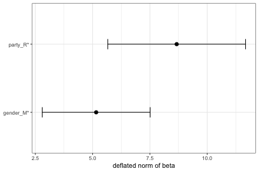
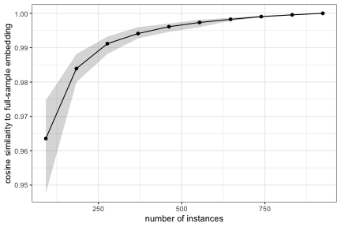
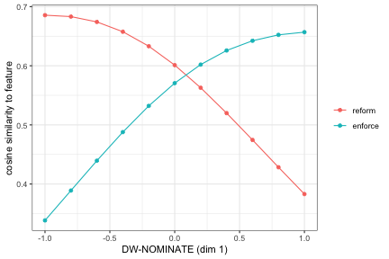

Embedding Regression with conText
================

This tutorial walks through the **embedding regression** workflow in
**conText** end to end: from a tokenized corpus to a fitted model, to
reading and visualizing the results, checking whether you have enough
data, predicting embeddings for covariate profiles, tracing usage along
a continuous covariate, and finding the neighbours that most
discriminate groups. It complements the [Quick Start
Guide](quickstart.md), which focuses on the descriptive (“nearest
neighbours”) tools and on building the ingredients (local embeddings and
the transformation matrix).

We use the small objects bundled with the package – `cr_sample_corpus`,
`cr_glove_subset` and `cr_transform` – so everything here is
reproducible. They are tiny, so treat the numbers as illustrative only.

``` r
library(conText)
library(quanteda)
library(dplyr)
library(ggplot2)
```

# What embedding regression does

For a focal term, conText represents **each instance** of that term by
an “*a la carte*” (ALC) embedding: the average of the pre-trained
embeddings of the words in its context, multiplied by a transformation
matrix `A`. Stacking those per-instance embeddings as the outcome `Y`,
conText fits


a multivariate regression of the embeddings on document-level covariates
`X`. Each coefficient `β` is itself a `D`-dimensional vector; its
(debiased, squared) **norm** measures how much that covariate shifts the
term’s usage, and conText attaches inference to those norms (a
permutation test for p-values and, optionally, a jackknife for
confidence intervals).

# Fitting a model

`conText()` takes a formula with the focal term on the left-hand side
and the covariates on the right, plus a tokenized corpus and the
pre-trained embeddings / transformation matrix.

``` r
toks <- tokens(cr_sample_corpus)

set.seed(2021L)
model <- conText(immigration ~ party + gender,
                 data = toks,
                 pre_trained = cr_glove_subset,
                 transform = TRUE, transform_matrix = cr_transform,
                 jackknife = TRUE,         # confidence intervals (the jackknife is fast)
                 permute = TRUE, num_permutations = 100,
                 verbose = FALSE)
```

Character/factor covariates are automatically turned into `0/1`
indicator variables, leaving out a base category. Here `party` becomes
`party_R` (base = Democrat) and `gender` becomes `gender_M` (base =
Female).

# Reading the results

The fitted object is a matrix of coefficients (one row per covariate,
including the intercept). Three methods make it easy to inspect.

`summary()` prints the model dimensions and the normed-coefficient
table:

``` r
summary(model)
```

    ## conText embedding regression
    ##   coefficients (incl. intercept): 3 | embedding dimensions: 300 | features: 488
    ## 
    ## # A tibble: 2 x 11
    ##   coefficient normed.estimate.orig normed.estimate.defl~1 normed.estimate.beta~2
    ##   <chr>                      <dbl>                  <dbl>                  <dbl>
    ## 1 party_R                    10.1                    8.67                   1.47
    ## 2 gender_M                    6.91                   5.15                   1.75
    ## # i abbreviated names: 1: normed.estimate.deflated,
    ## #   2: normed.estimate.beta.error.null
    ## # i 7 more variables: n <int>, n_obs <int>, covariate_mean <dbl>,
    ## #   std.error <dbl>, lower.ci <dbl>, upper.ci <dbl>, p.value <dbl>

`tidy()` returns that table as a tibble (handy for further manipulation
or plotting):

``` r
tidy(model)
```

    ## # A tibble: 2 x 11
    ##   coefficient normed.estimate.orig normed.estimate.defl~1 normed.estimate.beta~2
    ##   <chr>                      <dbl>                  <dbl>                  <dbl>
    ## 1 party_R                    10.1                    8.67                   1.47
    ## 2 gender_M                    6.91                   5.15                   1.75
    ## # i abbreviated names: 1: normed.estimate.deflated,
    ## #   2: normed.estimate.beta.error.null
    ## # i 7 more variables: n <int>, n_obs <int>, covariate_mean <dbl>,
    ## #   std.error <dbl>, lower.ci <dbl>, upper.ci <dbl>, p.value <dbl>

`plot()` shows the deflated norm of each coefficient with its confidence
interval (from the jackknife). Coefficients significant at the 0.05
level (using the permutation p-values) are marked with a `*`.

``` r
plot(model)
```

<!-- -->

# Do you have enough instances?

ALC is often used for rare terms, where a natural question is whether
you have enough instances of the focal term for a stable embedding.
`convergence_diagnostic()` answers this: it embeds the term from random
sub-samples of increasing size and measures how close each sub-sample
embedding is (cosine similarity) to the full-sample embedding. The curve
flattening towards 1 means the embedding has stabilized.

``` r
immig_toks <- tokens_context(toks, pattern = "immigration", window = 6L, verbose = FALSE)
immig_dem <- dem(dfm(immig_toks), pre_trained = cr_glove_subset,
                 transform = TRUE, transform_matrix = cr_transform, verbose = FALSE)

set.seed(2021L)
conv <- convergence_diagnostic(immig_dem, n_replicates = 15)

ggplot(conv, aes(n, value)) +
  geom_ribbon(aes(ymin = lower.ci, ymax = upper.ci), alpha = 0.2) +
  geom_line() + geom_point() +
  labs(x = "number of instances", y = "cosine similarity to full-sample embedding") +
  theme_bw()
```

<!-- -->

# Interaction effects

Interactions use the usual formula syntax. `party*gender` expands to
`party + gender + party:gender`; the interaction enters as the product
of the corresponding indicator columns and gets its own coefficient and
test.

``` r
set.seed(2021L)
model_int <- conText(immigration ~ party * gender,
                     data = toks,
                     pre_trained = cr_glove_subset,
                     transform = TRUE, transform_matrix = cr_transform,
                     jackknife = FALSE, permute = TRUE, num_permutations = 100,
                     verbose = FALSE)

rownames(model_int)
```

    ## [1] "(Intercept)"      "party_R"          "gender_M"         "party_R:gender_M"

# Predicting embeddings for covariate profiles

The coefficients combine into the ALC embedding for any covariate
profile. Rather than adding rows by hand, use `predict()` with a
`newdata` of profiles (columns are the coefficient names; interaction
columns are filled automatically from their components).

``` r
group_wvs <- predict(model_int,
                     newdata = data.frame(
                       party_R  = c(0, 0, 1, 1),
                       gender_M = c(0, 1, 0, 1),
                       row.names = c("Dem-Female", "Dem-Male", "Rep-Female", "Rep-Male")))
dim(group_wvs)
```

    ## [1]   4 300

The result is an ordinary matrix (one row per profile) that feeds
directly into the descriptive tools. For example, the nearest neighbours
of each group’s embedding:

``` r
nns(group_wvs, N = 5, pre_trained = cr_glove_subset, as_list = FALSE)
```

    ## # A tibble: 20 x 4
    ##    target     feature        rank value
    ##    <fct>      <chr>         <int> <dbl>
    ##  1 Rep-Male   immigration       1 0.879
    ##  2 Dem-Female immigration       1 0.849
    ##  3 Dem-Male   immigration       1 0.803
    ##  4 Rep-Female immigration       1 0.786
    ##  5 Dem-Male   broken            2 0.706
    ##  6 Rep-Male   illegal           2 0.701
    ##  7 Dem-Male   reform            3 0.685
    ##  8 Rep-Female illegal           2 0.674
    ##  9 Dem-Male   comprehensive     4 0.671
    ## 10 Rep-Female enforcement       3 0.670
    ## 11 Dem-Female immigrants        2 0.660
    ## 12 Rep-Female border            4 0.656
    ## 13 Rep-Male   enforce           3 0.639
    ## 14 Rep-Male   amnesty           4 0.635
    ## 15 Rep-Male   immigrants        5 0.634
    ## 16 Dem-Female enforcement       3 0.621
    ## 17 Rep-Female laws              5 0.615
    ## 18 Dem-Female legal             4 0.603
    ## 19 Dem-Female law               5 0.601
    ## 20 Dem-Male   illegal           5 0.560

# Continuous covariates: usage along a dimension

`predict()` also accepts continuous covariates, so you can trace how a
term’s usage moves along a scale – for instance the first dimension of
DW-NOMINATE (`nominate_dim1`), included in the sample corpus.

``` r
set.seed(2021L)
model_nom <- conText(immigration ~ nominate_dim1,
                     data = toks,
                     pre_trained = cr_glove_subset,
                     transform = TRUE, transform_matrix = cr_transform,
                     jackknife = FALSE, permute = TRUE, num_permutations = 100,
                     verbose = FALSE)

grid <- seq(-1, 1, by = 0.2)
nom_wvs <- predict(model_nom, newdata = data.frame(nominate_dim1 = grid,
                                                   row.names = as.character(grid)))

effects <- cos_sim(nom_wvs, pre_trained = cr_glove_subset,
                   features = c("reform", "enforce"), as_list = FALSE)

effects %>%
  mutate(nominate = as.numeric(target)) %>%
  ggplot(aes(nominate, value, color = feature)) +
  geom_line() + geom_point() +
  labs(x = "DW-NOMINATE (dim 1)", y = "cosine similarity to feature", color = NULL) +
  theme_bw()
```

<!-- -->

# Discriminant nearest neighbours

To see which neighbours most *distinguish* two groups, `get_nns_ratio()`
compares the cosine similarities of each group’s embedding to a set of
candidate features and returns their ratio, with a permutation p-value
per feature. Because that p-value is computed for many features at once,
use `p.adjust.method` to correct for multiple comparisons; an adjusted
p-value column is then returned alongside the raw one.

``` r
set.seed(2021L)
immig_party_ratio <- get_nns_ratio(x = immig_toks, N = 5,
                                   groups = docvars(immig_toks, "party"),
                                   numerator = "R",
                                   candidates = immig_dem@features,
                                   pre_trained = cr_glove_subset,
                                   transform = TRUE, transform_matrix = cr_transform,
                                   bootstrap = FALSE,
                                   permute = TRUE, num_permutations = 100,
                                   p.adjust.method = "BH",
                                   verbose = FALSE)
```

    ## NOTE: values refer to the ratio R/D.starting permutations 
    ## done with permutations

``` r
head(immig_party_ratio)
```

    ##       feature    value p.value p.value.adjusted  group
    ## 1     illegal 1.193326    0.00       0.00000000      R
    ## 2     amnesty 1.190681    0.00       0.00000000      R
    ## 3        laws 1.183587    0.00       0.00000000      R
    ## 4 enforcement 1.093526    0.02       0.02571429      R
    ## 5  immigrants 1.034103    0.24       0.24000000      D
    ## 6 immigration 1.031344    0.04       0.04500000 shared

# Weighting the context words

By default each context word contributes to the average by its count
(`weighting = "uniform"`). `dem()` and `conText()` also support
`weighting = "sif"`, which applies smooth inverse-frequency weighting
(Arora et al. 2017), downweighting very frequent context words before
averaging:

``` r
set.seed(2021L)
model_sif <- conText(immigration ~ party + gender,
                     data = toks, pre_trained = cr_glove_subset,
                     transform = TRUE, transform_matrix = cr_transform,
                     jackknife = FALSE, permute = FALSE,
                     weighting = "sif",
                     verbose = FALSE)
tidy(model_sif)
```

    ## # A tibble: 2 x 7
    ##   coefficient normed.estimate.orig normed.estimate.defl~1 normed.estimate.beta~2
    ##   <chr>                      <dbl>                  <dbl>                  <dbl>
    ## 1 party_R                    0.472                  0.304                  0.169
    ## 2 gender_M                   0.373                  0.162                  0.211
    ## # i abbreviated names: 1: normed.estimate.deflated,
    ## #   2: normed.estimate.beta.error.null
    ## # i 3 more variables: n <int>, n_obs <int>, covariate_mean <dbl>

# Notes on inference and performance

-   **Test statistic.** conText tests the *debiased* squared norm of
    each coefficient (`normed.estimate.deflated`), which subtracts an
    estimate of the sampling-noise contribution from the raw norm (Green
    et al. 2025). The raw norm (`normed.estimate.orig`) is also
    reported.
-   **p-values vs. intervals.** `permute = TRUE` gives empirical
    p-values via a permutation test; `jackknife = TRUE` adds standard
    errors and confidence intervals. The jackknife is computed
    analytically, so it is fast even on larger corpora.
-   **Clustering.** Pass `cluster_variable` to cluster the standard
    errors (e.g. by speaker), so repeated instances from the same unit
    are not treated as independent.
-   **Multiple comparisons.** When testing many features at once
    (e.g. in `get_nns_ratio()`), use `p.adjust.method` to control the
    false-positive rate.
-   **Validate.** A norm being “significant” is a statement about word
    *usage*, not automatically about your substantive construct –
    triangulate with nearest neighbours, nearest contexts, and domain
    knowledge.

# References

Rodriguez, P. L., Spirling, A., and Stewart, B. M. (2023). Embedding
Regression: Models for Context-Specific Description and Inference.
*American Political Science Review*, 117(4), 1255-1274.

Khodak, M., Saunshi, N., Liang, Y., Ma, T., Stewart, B., and Arora, S.
(2018). A La Carte Embedding: Cheap but Effective Induction of Semantic
Feature Vectors. *ACL*.

Arora, S., Liang, Y., and Ma, T. (2017). A Simple but Tough-to-Beat
Baseline for Sentence Embeddings. *ICLR*.
